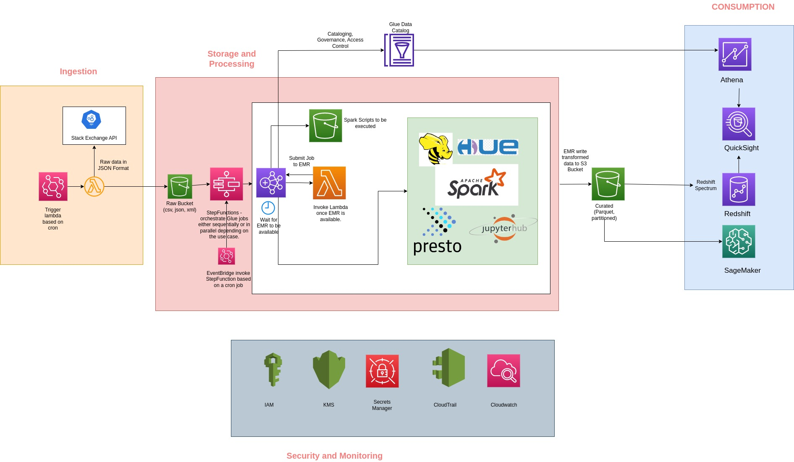

# StackOverflow Data Analytics Pipeline

# Architecure 1


The pipeline consists of the following components:

1. Lambda function for ingesting data from the StackOverflow API and storing RAW data it in an S3 bucket.
2. AWS Glue job for processing the RAW data and storing it in Parquet format in S3 data lake.
3. AWS Athena for querying the processed data and performing analysis.
4. Step Functions to run the AWS Glue job(s) sequentially or parallely.
5. EventBridge to trigger the Lambda function periodically to ingest new data.
6. SNS Topic to send notifications in case of a pipeline failure.

# Lambda Function for Data Ingestion

This is a Lambda function that retrieves data from a public API and saves it into an S3 bucket. This function is triggered by a Event Bridge rule with a scheduled expression that runs every hour.

```terminal
app/ingesting-data.py
```

### Usage

Create a new AWS Lambda function and upload the lambda_function.py file.
Set up a Event Bridge rule to trigger the Lambda function on a schedule.

### Configuration

The file contains the following parameters:

s3_bucket: The name of the S3 bucket where data will be stored.

api_endpoint: The endpoint of the public API to retrieve data from.

# PySpark Batch Processing

This is a PySpark script that reads JSON files from an S3 bucket, processes the data, and writes the results as Parquet files back to S3. The job uses the Glue Data Catalog to keep track of metadata.

```terminal
app/processing-data.py
```

### Usage

Update the file with your S3 bucket name and result bucket name. Result bucket is where the processed data will be written in Parquet format

Configure StepFunction to run Glue Job(s) sequentially

The job has the following parameter

s3_input_bucket: The name of the S3 bucket where input data is stored.

s3_output_bucket: The name of the S3 bucket where output data will be stored.

Database name and table name for the Glue Data Catalog.

# AWS Athena

The processed data can be queried using AWS Athena, either through the Athena console or using Python or AWS Glue scripts. The Athena queries can be used to perform analysis on the processed data.

This is a Python code snippet that demonstrates how to execute a query using AWS Athena and retrieve the results as a Pandas DataFrame.

```terminal
app/consuming-data.py
```

### Usage

Replace the query variable with your desired SQL query.
Replace the database and table variables with the name of your Athena database and table.
Run the code.

# Step Functions

The Step Functions are used to orchestrate the AWS Glue jobs, enabling them to run either sequentially or in parallel. If any of the Glue jobs fail, the Step Function sends email alerts via SNS. This Step Function can also be integrated with other AWS services based on the specific use case.

```terminal
infrastructure/stepfunction.json
```

# EventBridge

EventBridge triggers the Lambda function periodically to ingest new data from the StackOverflow API.

```terminal
infrastructure/event-bridge.yaml
```

# SNS Topic

An SNS topic is set up to send notifications in case of a Glue Job fails.

```terminal
infrastructure/sns-topic.yaml
```

# Alternative Data Analytics Architecture

## Architecure 2 using EMR



## Architecure 3 using Event Driven Architecture


## Architecure Explaination

[Architecture Design](architecture-design/architecture_design.pdf)
